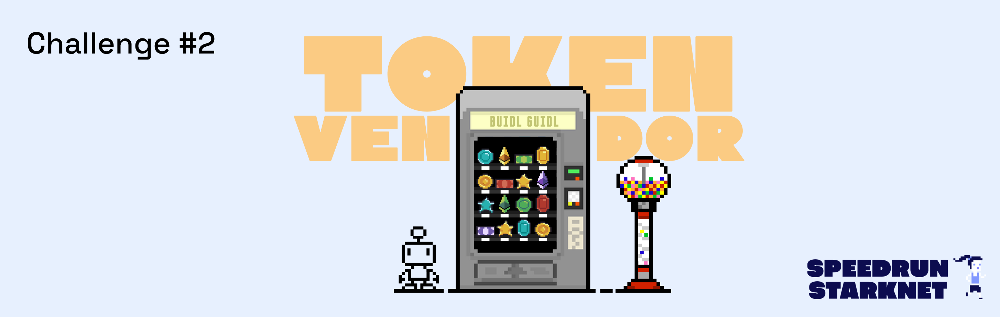
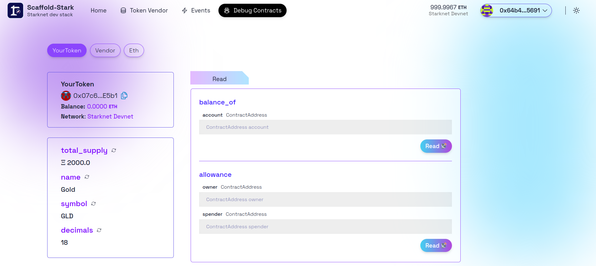
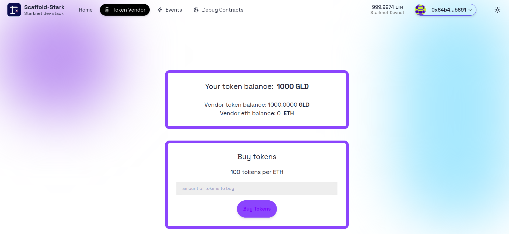
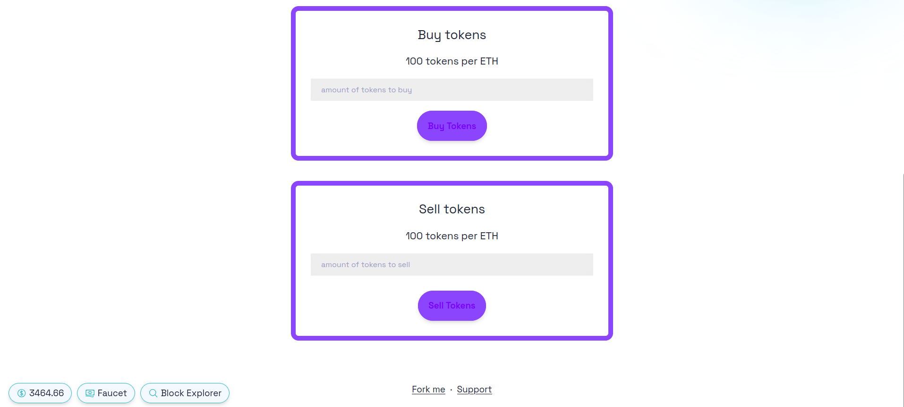
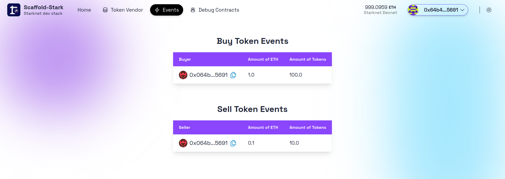

# 🚩 Challenge #2: 🏵 Token Vendor 🤖



🤖 Smart contracts are kind of like "always on" _vending machines_ that **anyone** can access. Let's make a decentralized, digital currency. Then, let's build an unstoppable vending machine that will buy and sell the currency. We'll learn about the "approve" pattern for ERC20s and how contract to contract interactions work.

🏵 Look at `YourToken.cairo` smart contract that reuses the **ERC20** token standard as a component from OpenZeppelin. You have to set `your token` to `mint()` **2000** \* (10^18) tokens to the `recipient` account address. Then create a `Vendor.cairo` contract that sells `your token` using a `buy_tokens()` function.

🎛 Edit the frontend that invites the user to input an amount of tokens they want to buy. We'll display a preview of the amount of ETH it will cost with a confirm button.

🌟 The final deliverable is an app that lets users purchase your ERC20 token, transfer it, and sell it back to the vendor. Deploy your contracts on your public chain of choice and then `yarn vercel` your app to a public web server.

> 💬 Meet other builders working on this challenge or get help in the [Builders telegram chat](https://t.me/+wO3PtlRAreo4MDI9)!

---

## Checkpoint 0: 📦 Environment 📚

Before you begin, you need to install the following tools:

- [Node (>= v18.17)](https://nodejs.org/en/download/)
- Yarn ([v1](https://classic.yarnpkg.com/en/docs/install/) or [v2+](https://yarnpkg.com/getting-started/install))
- [Git](https://git-scm.com/downloads)

### Compatible versions

- Starknet-devnet - v0.0.4
- Scarb - v2.6.5
- Snforge - v0.27.0
- Cairo - v2.6.4

Make sure you have the compatible versions otherwise refer to [Scaffold-Stark Requirements](https://github.com/Quantum3-Labs/scaffold-stark-2?.tab=readme-ov-file#requirements)

Then download the challenge to your computer and install dependencies by running:

```sh
git clone https://github.com/Quantum3-Labs/speedrunstark.git challenge-2-token-vendor
cd challenge-2-token-vendor
git checkout challenge-2-token-vendor
yarn install
```

> in the same terminal, start your local network (a blockchain emulator in your computer):

```bash
yarn chain
```

> in a second terminal window, 🛰 deploy your contract (locally):

```sh
cd challenge-2-token-vendor
yarn deploy
```

> in a third terminal window, start your 📱 frontend:

```sh
cd challenge-2-token-vendor
yarn start
```

📱 Open <http://localhost:3000> to see the app.

> 👩‍💻 Rerun `yarn deploy` whenever you want to deploy new contracts to the frontend. If you haven't made any contract changes, you can run `yarn deploy:reset` for a completely fresh deploy.

---

## Checkpoint 1: 🏵Your Token 💵

> 👩‍💻 Look at `YourToken.cairo` how it reuses the **ERC20** token standard from OpenZeppelin. To accomplish this, we used [`Cairo Components`](https://book.cairo-lang.org/ch16-02-00-composability-and-components.html) to embed the `ERC20` logic inside your contract.

> You have to mint **2000** (\* 10 \*\* 18) to your frontend address using the `constructor()`. In devnet, by default we choose the first pre-deployed account: `0x64b48806902a367c8598f4f95c305e8c1a1acba5f082d294a43793113115691`, to deploy the contracts. In order to complete this checkpoint, you need to connect to devnet using the same address. In testnet, you can use your own address to deploy the contracts. Edit the .env file in the `snfoundry` package to set the `ACCOUNT_ADDRESS_SEPOLIA` to your own address.

(Your frontend address is the address in the top right of <http://localhost:3000>)

> You can `yarn deploy:reset` to deploy your contract until you get it right.

### 🥅 Goals

- [ ] Can you check the `balance_of()` your frontend address in the `Debug Contracts` tab? (**YourToken** contract)
- [ ] Can you `transfer()` your token to another account and check _that_ account's `balance_of`?



> 💬 Hint: In Devnet, use the `switch account` feature to select a different pre-deployed account address and try sending to that new address. Can use the `transfer()` function in the `Debug Contracts` tab.

---

## Checkpoint 2: ⚖️ Vendor 🤖

> 👩‍💻 Edit the `Vendor.cairo` contract with a `buy_tokens()` function implementation.

Create a price variable named `tokensPerEth` set to **100**:

```cairo
const TokensPerEth: u256 = 100;
```

> 📝 The `buy_tokens()` function in `Vendor.cairo` should use `eth_amount_wei` value and `tokensPerEth` to calculate an amount of tokens to `transfer`(self.your_token.read().transfer()) to `recipient`.

> 📟 Emit **event** `BuyTokens {buyer: ContractAddress, eth_amount: u256, tokens_amount: u256}` when tokens are purchased.

Edit `packages/snfoundry/scripts-ts/deploy.ts` to deploy the `Vendor` (uncomment Vendor deploy lines).

Implement/modify `tokens_per_eth` function in `Vendor.cairo` that returns the `tokensPerEth` value.

Uncomment the `Buy Tokens` sections in `packages/nextjs/app/token-vendor/page.tsx` to show the UI to buy tokens on the Token Vendor tab.

### 🥅 Goals

- [ ] When you try to buy tokens from the vendor, you should get an error: **'u256_sub Overflow'**. This error is related to the `transfer_from`, `transfer`, approve function in the `YourToken` contract.

⚠️ You might face this error because the Vendor contract doesn't have any `YourToken` yet!. You can create an `assert` in the `buy_tokens()` function to check if the Vendor has enough tokens to sell.

⚔️ Side Quest: Using Ui with `transfer tokens` section, send tokens from your frontend address to the Vendor contract address and _then_ try to buy them.

> ✏️ We can't hard code the vendor address like we did above when deploying to the network because we won't know the vendor address at the time we create the token contract.

> ✏️ Then, uncomment `packages/snfoundry/scripts-ts/deploy.ts` to transfer 1000 tokens to vendor address.

```ts
  await deployer.execute(
    [
      {
        contractAddress: your_token.address,
        calldata: [
          vendor.address,
          {
            low:  1_000_000_000_000_000_000_000n, //1000 * 10^18
            high: 0,
          }
        ],
        entrypoint: "transfer",
      }
    ],
    {
      maxFee: 1e18
    }
  );
```

> 🔎 Look in `packages/nextjs/app/token-vendor/page.tsx` for code to uncomment to display the Vendor ETH and Token balances.

> You can `yarn deploy:reset` to deploy your contract until you get it right.



### 🥅 Goals

- [ ] Does the `Vendor` address start with a `balance_of` **1000** in `YourToken` on the `Debug Contracts` tab?
- [ ] Can you buy **10** tokens for **0.1** ETH?
- [ ] Can you transfer tokens to a different account?

> 📝 Look at `Vendor.cairo` how to reuse _Ownable_ component from OpenZeppelin.

```cairo
 #[storage]
    struct Storage {
        ...
        #[substorage(v0)]
        ownable: OwnableComponent::Storage,
    }
```

In `Vendor.cairo` you will need to add one more input parameter to setup the `owner` in the `constructor()`.

> ✏️ Then, edit `packages/snfoundry/scripts-ts/deploy.ts` to deploy the `Vendor` contract with the `owner` address.

```ts
 vendor = await deployContract({
    contract: "Vendor",
    constructorArgs: {
      eth_token_address:
      "0x49D36570D4E46F48E99674BD3FCC84644DDD6B96F7C741B1562B82F9E004DC7",
      your_token_address: your_token.address,
      owner: deployer.address,
    },
  });
```

### 🥅 Goals

- [ ] Is your frontend address the `owner` of the `Vendor`?

> 📝 Finally, Implement a `withdraw()` function in `Vendor.cairo` that lets the owner withdraw all the ETH from the vendor contract.

### 🥅 Goals

- [ ] Can **only** the `owner` withdraw the ETH from the `Vendor`?

### ⚔️ Side Quests

- [ ] What if you minted **2000** and only sent **1000** to the `Vendor`?

---

## Checkpoint 3: 🤔 Vendor Buyback 🤯

👩‍🏫 The hardest part of this challenge is to build your `Vendor` to buy the tokens back.

🧐 The reason why this is hard is the `approve()` pattern in ERC20s.

😕 First, the user has to call `approve()` on the `YourToken` contract, approving the `Vendor` contract address to take some amount of tokens.

🤨 Then, the user makes a _second transaction_ to the `Vendor` contract to `sellTokens(amount_tokens: u256)`.

🤓 The `Vendor` should call `fn transfer_from(ref self: ContractState, sender: ContractAddress, recipient: ContractAddress, amount: u256) -> bool` and if the user has approved the `Vendor` correctly, tokens should transfer to the `Vendor` and ETH should be sent to the user.

🤩 In the UI, you can use `useScaffoldMultiWriteContract.ts` to call `approve` and `buy / sell tokens`

> 📝 Edit `Vendor.cairo` and implement the `sellTokens(amount_tokens: u256)` function!

🔨 Use the `Debug Contracts` tab to call the approve and sellTokens() at first but then...

🔍 Look in the `packages/nextjs/app/token-vendor/page.tsx` for the extra approve/sell UI to uncomment!



### 🥅 Goal

- [ ] Can you sell tokens back to the vendor?
- [ ] Do you receive the right amount of ETH for the tokens?

### ⚔️ Side Quests

- [ ] Should we disable the `owner` withdraw to keep liquidity in the `Vendor`?
- [ ] It would be a good idea to display Sell Token Events. Create an **event**
      `SellTokens {seller: ContractAddress, tokens_amount: u256, eth_amount: u256}`
      and `emit` it in your `Vendor.cairo` and uncomment `SellTokens Events` section in your `packages/nextjs/app/events/page.tsx` to update your frontend.

  

### ⚠️ Test it

- Now is a good time to run `yarn test` to run the automated testing function. It will test that you hit the core checkpoints. You are looking for all green checkmarks and passing tests!

---

## Checkpoint 4: 💾 Deploy your contracts! 🛰

📡 Find the `packages/nextjs/scaffold.config.ts` file and change the `targetNetworks` to `[chains.sepolia]`.


🔐 Prepare your environment variables.

> Find the `packages/snfoundry/.env` file and fill the env variables related to Sepolia testnet with your own contract address and private key.

⛽️ You will need to get some `ETH` or `STRK` Sepolia tokens to deploy your contract to Sepolia testnet.

🚀 Run `yarn deploy --network [network]` to deploy your smart contract to a public network (mainnet or sepolia).

> 💬 Hint: you input `yarn deploy --network sepolia`.

> 💬 Hint: For faster loading of your _"Events"_ page, consider updating the `fromBlock` passed to `useScaffoldEventHistory` in [`packages/nextjs/app/events/page.tsx`](https://github.com/Quantum3-Labs/speedrunstark/blob/challenge-2-token-vendor/packages/nextjs/app/events/page.tsx) to `blocknumber - 10` at which your contract was deployed. Example: `fromBlock: 3750241n` (where `n` represents its a [BigInt](https://developer.mozilla.org/en-US/docs/Web/JavaScript/Reference/Global_Objects/BigInt)). To find this blocknumber, search your contract's address on Starkscan and find the `Contract Creation` transaction line.

---

## Checkpoint 5: 🚢 Ship your frontend! 🚁

> 🦊 Since we have deployed to a public testnet, you will now need to connect using a wallet you own(Argent X or Braavos).

💻 View your frontend at <http://localhost:3000/stakerUI> and verify you see the correct network.

📡 When you are ready to ship the frontend app...

📦 Run `yarn vercel` to package up your frontend and deploy.

> Follow the steps to deploy to Vercel. Once you log in (email, github, etc), the default options should work. It'll give you a public URL.

> If you want to redeploy to the same production URL you can run `yarn vercel --prod`. If you omit the `--prod` flag it will deploy it to a preview/test URL.

#### Configuration of Third-Party Services for Production-Grade Apps

By default, 🏗 Scaffold-Stark provides predefined Open API endpoint for some services such as Blast. This allows you to begin developing and testing your applications more easily, avoiding the need to register for these services.
This is great to complete your **SpeedRunStark**.

For production-grade applications, it's recommended to obtain your own API keys (to prevent rate limiting issues). You can configure these at:

🔷 `RPC_URL_SEPOLIA` variable in `packages/snfoundry/.env` and `packages/nextjs/.env.local`. You can create API keys from the [Alchemy dashboard](https://dashboard.alchemy.com/).

> 💬 Hint: It's recommended to store env's for nextjs in Vercel/system env config for live apps and use .env.local for local testing.

---

> 🏃 Head to your next challenge [here](https://github.com/Quantum3-Labs/speedrunstark/tree/challenge-3-dice-game).
>
> � Problems, questions, comments on the stack? Post them to the [🏗 Scaffold-Stark developers chat](https://t.me/+wO3PtlRAreo4MDI9)
