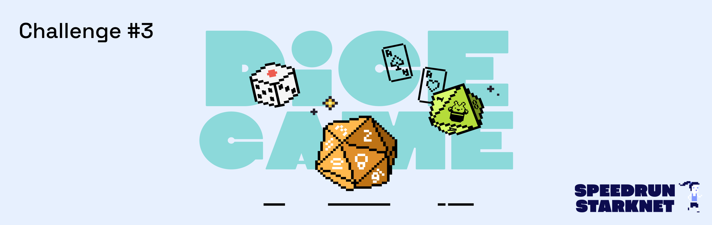
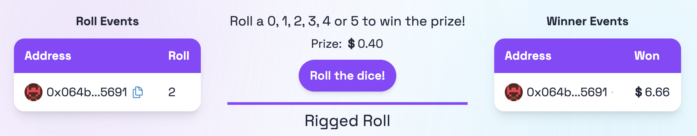
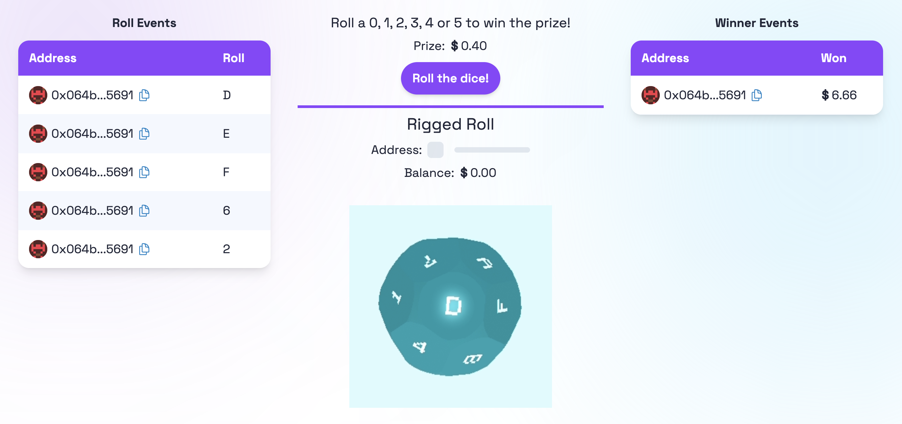
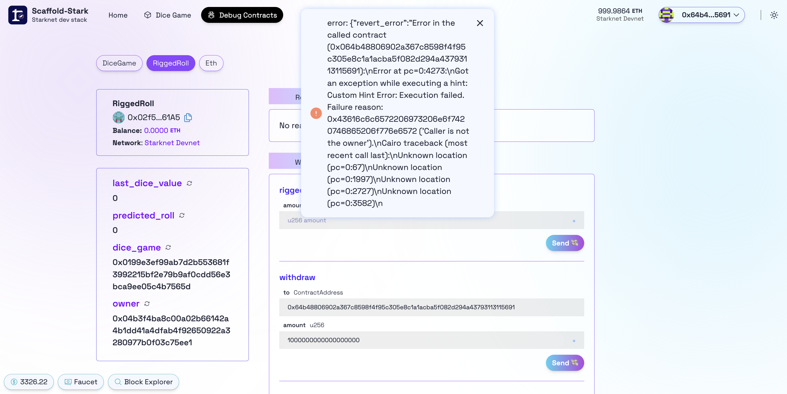

# 🚩 Challenge 3: 🎲 Dice Game



📚 This tutorial is meant for developers that already understand the 🖍️ basics: [Starklings](https://starklings.app/) or [Node Guardians](https://nodeguardians.io/campaigns?f=3%3D2)

> 🎰 Randomness is tricky on a public deterministic blockchain. The block hash is an easy to use, but very weak form of randomness. This challenge will give you an example of a contract using block hash to create random numbers. This randomness is exploitable. Other, stronger forms of randomness include commit/reveal schemes, oracles, or VRF from Chainlink.

> 💬 Dice Game is a contract that allows users to roll the dice to try and win the prize. If players roll either a 0, 1, 2, 3, 4 or 5 they will win the current prize amount. The initial prize is 10% of the contract's balance, which starts out at .05 Eth.

> 🧤 Every time a player rolls the dice, they are required to send .002 Eth. 40 percent of this value is added to the current prize amount while the other 60 percent stays in the contract to fund future prizes. Once a prize is won, the new prize amount is set to 10% of the total balance of the DiceGame contract.

> 🧨 Your job is to attack the Dice Game contract! You will create a new contract that will predict the randomness ahead of time and only roll the dice when you're guaranteed to be a winner!

> 💬 Submit this challenge, meet other builders working on this challenge or get help in the [Builders telegram chat](https://t.me/+wO3PtlRAreo4MDI9)!

---

## Checkpoint 0: 📦 Environment 📚

Before you begin, you need to install the following tools:

- [Node (>= v18.17)](https://nodejs.org/en/download/)
- Yarn ([v1](https://classic.yarnpkg.com/en/docs/install/) or [v2+](https://yarnpkg.com/getting-started/install))
- [Git](https://git-scm.com/downloads)
- [Rust](https://www.rust-lang.org/tools/install)
- [asdf](https://asdf-vm.com/guide/getting-started.html)
- [Cairo 1.0 extension for VSCode](https://marketplace.visualstudio.com/items?itemName=starkware.cairo1)

### Compatible versions

- Starknet-devnet - v0.0.4
- Scarb - v2.6.5
- Snforge - v0.27
- Cairo - v2.6.4
- Rpc - v0.7.0

Make sure you have the compatible versions otherwise refer to [Scaffold-Stark Requirements](https://github.com/Scaffold-Stark/scaffold-stark-2?.tab=readme-ov-file#requirements)

Then download the challenge to your computer and install dependencies by running:

```sh

git clone https://github.com/Scaffold-Stark/speedrunstark.git challenge-3-dice-game
cd challenge-3-dice-game
git checkout challenge-3-dice-game
yarn install
```

> in the same terminal, start your local network (a local instance of a blockchain):

```bash
yarn chain
```

> in a second terminal window, 🛰 deploy your contract (locally):

```sh
cd challenge-3-dice-game
yarn deploy
```

> in a third terminal window, start your 📱 frontend:

```sh
cd challenge-3-dice-game
yarn start
```

📱 Open [http://localhost:3000](http://localhost:3000) to see the app.

> 👩‍💻 Rerun `yarn deploy` whenever you want to deploy new contracts to the frontend.

---

## Checkpoint 1: 🎲 Dice Game

🔍 Inspect the code in the `DiceGame.cairo` contract in `packages/snfoundry/contracts`

🔒 You will not be changing any code in the `DiceGame.cairo` contract in this challenge. You will write your own contract to predict the outcome, then only roll the dice when it is favourable.

💸 Connect to the first prefunded account of `starknet devnet` clicking on the top right `Connect` button, and roll the dice a few times. Watch the balance of the DiceGame contract in the Debug tab. It increases on a failed roll and decreases by the prize amount on a successful roll.

### 🥅 Goals

- [ ] Track the cairo code to find out how the DiceGame contract is generating random numbers.
- [ ] Is it possible to predict the random number for any given roll?

---

## Checkpoint 2: 🔑 Rigged Contract

In the  RiggedRoll contract implement the `rigged_roll()` function. This function should predict the randomness of a roll, and if the outcome will be a winner, call `roll_dice()` on the DiceGame contract.

🃏 Predict the outcome by generating your random numbers in the exact same way as the DiceGame contract.

> 📣 Reminder! Calling `roll_dice()` will fail unless you transfer a value of at least .002 Eth!. That's why in order to call `rigged_roll()` the user will need to transfer a value of at least .002 Eth.

🚀 To deploy your RiggedRoll contract, uncomment the appropriate lines in the `deploy.ts` file in `packages/snfoundry/script-ts/deploy.ts`

💸 In case you need some funds, you can use the Faucet button at the bottom left of the page.

❓ If you're struggling to get the exact same random number as the DiceGame contract, go to the `test` folder, and try adding some `println!` statements in some tests, it will help you track the values. These messages will appear in terminal where you run `yarn test`.

### ⚔️ Side Quest

- [ ] Add a statement to require `assert(contract_balance >= 2000000000000000,` in your riggedRoll function. This will help prevent calling the `roll_dice()` function without enough value.
- [ ] Uncomment the code in `packages/nextjs/app/dice/page.tsx` to show a riggedRoll button and contract balance on the main UI tab. Now you can test your function without switching tabs.
- [ ] Does your riggedRoll function only call `roll_dice()` when it's going to be a winning roll? What happens when it does call `roll_dice()`?



---

## Checkpoint 3: 💵 Where's my money?!?

You have beaten the game, but where is your money? Since the RiggedRoll contract is the one calling `roll_dice()`, that is where the prize money is being sent.



📥 Implement the `fn withdraw(ref self: ContractState, to: ContractAddress, amount: u256)` function to allow you to send Eth from RiggedRoll to another address.

### 🥅 Goals

- [ ] Can you send value from the RiggedRoll contract to your front end address?
- [ ] Is anyone able to call the withdraw function? What would be the downside to that?

### ⚔️ Side Quest

- [ ] Lock the withdraw function so it can only be called by the owner.



> ⚠️ But wait, I am not the owner! You will want to set your deployer address as the owner in `deploy.ts`. This will allow your deployer address to call the withdraw function.

## Checkpoint 4: 💾 Deploy your contracts! 🛰

📡 Find the `packages/nextjs/scaffold.config.ts` file and change the `targetNetworks` to `[chains.sepolia]`.


🔐 Prepare your environment variables.

> Find the `packages/snfoundry/.env` file and fill the env variables related to Sepolia testnet with your own contract address and private key.

⛽️ You will need to get some `ETH` or `STRK` Sepolia tokens to deploy your contract to Sepolia testnet.

🚀 Run `yarn deploy --network [network]` to deploy your smart contract to a public network (mainnet or sepolia).

> 💬 Hint: you input `yarn deploy --network sepolia`.

---

## Checkpoint 5: 🚢 Ship your frontend! 🚁

> 🦊 Since we have deployed to a public testnet, you will now need to connect using a wallet you own(Argent X or Braavos).

💻 View your frontend at <http://localhost:3000/dice> and verify you see the correct network.

📡 When you are ready to ship the frontend app...

📦 Run `yarn vercel` to package up your frontend and deploy.

> Follow the steps to deploy to Vercel. Once you log in (email, github, etc), the default options should work. It'll give you a public URL.

> If you want to redeploy to the same production URL you can run `yarn vercel --prod`. If you omit the `--prod` flag it will deploy it to a preview/test URL.

#### Configuration of Third-Party Services for Production-Grade Apps

By default, 🏗 Scaffold-Stark provides predefined Open API endpoint for some services such as Blast. This allows you to begin developing and testing your applications more easily, avoiding the need to register for these services.
This is great to complete your **SpeedRunStark**.

For production-grade applications, it's recommended to obtain your own API keys (to prevent rate limiting issues). You can configure these at:

🔷 `RPC_URL_SEPOLIA` variable in `packages/snfoundry/.env` and `packages/nextjs/.env.local`. You can create API keys from the [Alchemy dashboard](https://dashboard.alchemy.com/).

> 💬 Hint: It's recommended to store env's for nextjs in Vercel/system env config for live apps and use .env.local for local testing.

---

> 🏃 Head to your next challenge [here](https://speedrunstark.com/).

> 💬 Problems, questions, comments on the stack? Post them to the [🏗 scaffold-stark developers chat](https://t.me/+wO3PtlRAreo4MDI9)
