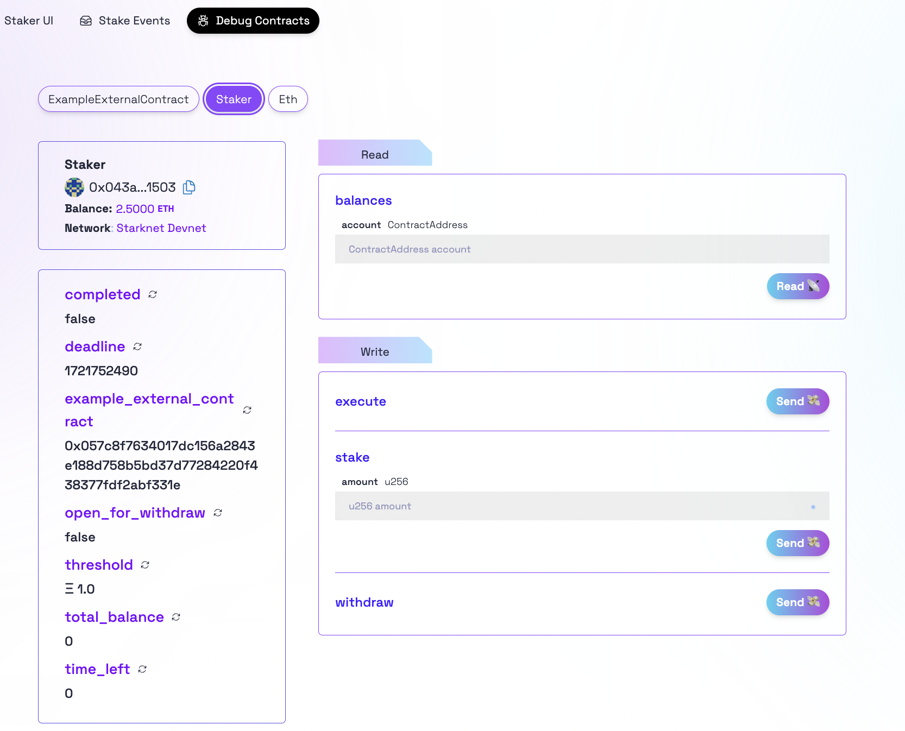
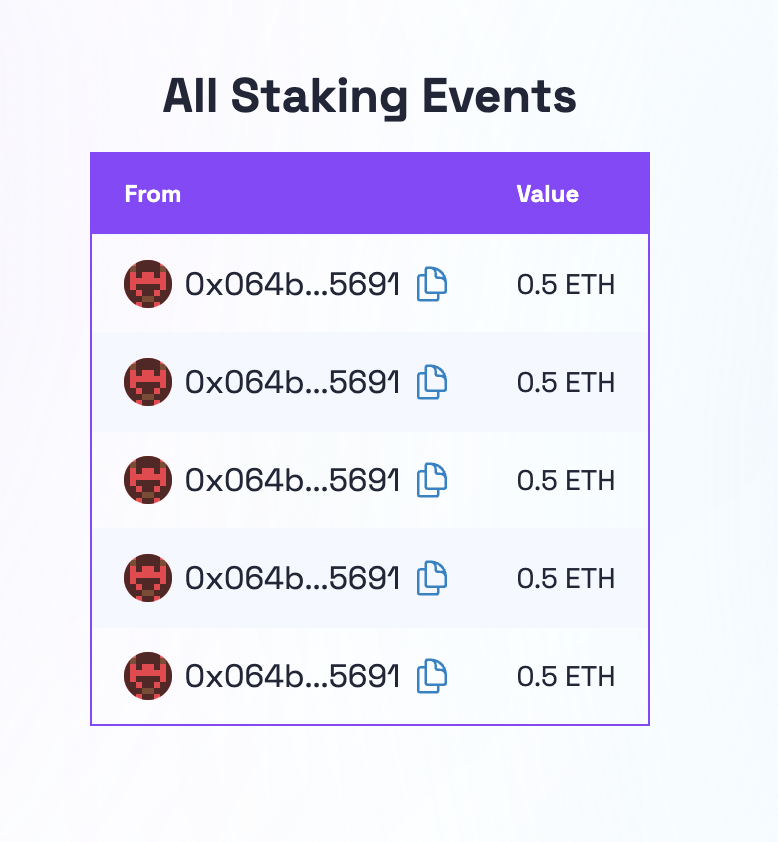
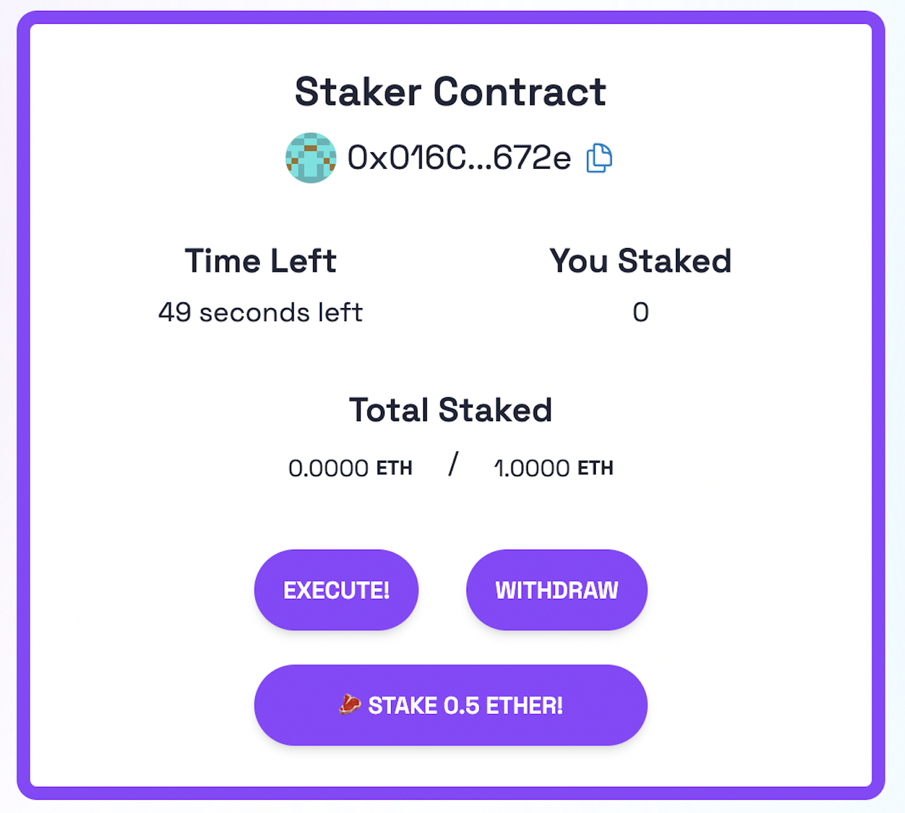

# 🚩 Challenge #1: 🔏 Decentralized Staking App


📚 This tutorial is meant for developers that already understand the 🖍️ basics: [Starklings](https://starklings.app/) or [Node Guardians](https://nodeguardians.io/campaigns?f=3%3D2)

🦸 A superpower of Smart contracts is allowing you, the builder, to create a simple set of rules that an adversarial group of players can use to work together. In this challenge, you create a decentralized application where users can coordinate a group funding effort. If the users cooperate, the money is collected in a second smart contract. If they defect, the worst that can happen is everyone gets their money back. The users only have to trust the code.

🏦 Build a `Staker.cairo` contract that collects **ETH** from numerous addresses using a function `stake()` function and keeps track of `balances`. After some `deadline` if it has at least some `threshold` of ETH, it sends it to an `ExampleExternalContract` and triggers the `complete()` action sending the full balance. If not enough **ETH** is collected, allows users to `withdraw()`.

🎛 Building the frontend to display the information and UI is just as important as writing the contract. The goal is to deploy the contract and the app to allow anyone to stake using your app. Use a `Stake {sender: ContractAddress, amount: u256}` Starknet event to list all stakes.

🌟 The final deliverable is deploying a Dapp that lets users send ether to a contract and stake if the conditions are met, then `yarn vercel` your app to a public webserver.

💬 Submit this challenge, meet other builders working on this challenge or get help in the [Builders telegram chat](https://t.me/+wO3PtlRAreo4MDI9)!

---

## Checkpoint 0: 📦 Environment 📚

Before you begin, you need to install the following tools:

- [Node (>= v18.17)](https://nodejs.org/en/download/)
- Yarn ([v1](https://classic.yarnpkg.com/en/docs/install/) or [v2+](https://yarnpkg.com/getting-started/install))
- [Git](https://git-scm.com/downloads)
- [Rust](https://www.rust-lang.org/tools/install)
- [asdf](https://asdf-vm.com/guide/getting-started.html)
- [Cairo 1.0 extension for VSCode](https://marketplace.visualstudio.com/items?itemName=starkware.cairo1)
  
### Compatible versions

- Starknet-devnet - v0.2.0
- Scarb - v2.8.3
- Snforge - v0.31.0
- Cairo - v2.8.2
- Rpc - v0.7.1

Make sure you have the compatible versions otherwise refer to [Scaffold-Stark Requirements](https://github.com/Scaffold-Stark/scaffold-stark-2?.tab=readme-ov-file#requirements)

Then download the challenge to your computer and install dependencies by running:

```sh
git clone https://github.com/Scaffold-Stark/speedrunstark.git challenge-1-decentralized-staking
cd challenge-1-decentralized-staking
git checkout challenge-1-decentralized-staking
yarn install
```

> in the same terminal, start your local network (a blockchain emulator in your computer):

```bash
yarn chain
```

> in a second terminal window, 🛰 deploy your contract (locally):

```sh
cd challenge-1-decentralized-staking
yarn deploy
```

> in a third terminal window, start your 📱 frontend:

```sh
cd challenge-1-decentralized-staking
yarn start
```

📱 Open <http://localhost:3000> to see the app.

> 👩‍💻 Rerun `yarn deploy` whenever you want to deploy new contracts to the frontend. If you haven't made any contract changes, you can run `yarn deploy:reset` for a completely fresh deploy.

🔏 Now you are ready to edit your smart contract `Staker.cairo` in `packages/sfoundry/contracts`.

---

⚗️ At this point you will need to know basic Cairo syntax. If not, you can pick it up quickly by tinkering with concepts from [📑 The Cairo Book](https://book.cairo-lang.org/ch13-00-introduction-to-starknet-smart-contracts.html) using [🏗️ Scaffold-Stark](https://www.scaffoldstark.com/). (In particular:  Contract's State, storage variables, interface, mappings, events, traits, constructor, and public/private functions.)

---

## Checkpoint 1: 🥩 Staking 💵

You'll need to track individual `balances` using a LegacyMap:

```cairo
#[storage]
struct Storage {
 eth_token_dispatcher: IERC20CamelDispatcher,
 balances: Map<ContractAddress, u256>,
 ...
}
```

And also track a constant threshold at 1 ether.

```cairo
const THRESHOLD: u256 = 1000000000000000000;
```

### Checkpoint 1.1: Handling ETH Transactions in Starknet

In Starknet, `ETH` is managed as a token, which means you cannot directly `send value` through a transaction. Meaning you must `approve` ETH spending and then `transfer` it using a contract. This involves utilizing the predeployed `ETH contract address` in Starknet.

In this challenge, we’ll demonstrate how to handle ETH transactions by passing the ETH contract address as an argument to the contract constructor.

First, you have to define your constructor function in the `Staker` contract:

```cairo
 #[constructor]
    pub fn constructor(
        ref self: ContractState,
        eth_contract: ContractAddress,
  ...
    ) 
```

Then, pass the `eth_contract` address as an argument to the `deployContract` function in the `deploy.ts` file:

```ts
  await deployContract({
    contract: "Staker",
    constructorArgs: {
      eth_contract:
        "0x49D36570D4E46F48E99674BD3FCC84644DDD6B96F7C741B1562B82F9E004DC7",
      ...
    },
  });
```

Next, import the `IERC20CamelDispatcher` struct from the `OpenZeppelin` library:

```cairo
use openzeppelin::token::erc20::interface::{IERC20CamelDispatcher, IERC20CamelDispatcherTrait};
```

In the constructor function, instantiate the `IERC20CamelDispatcher` struct with the address of the ETH contract address:

```cairo
self.eth_token_dispatcher.write(IERC20CamelDispatcher { contract_address: eth_contract });
```

With the dispatcher set up, you can now utilize functions defined in the interface, such as `transfer`, `transferFrom`, and `balanceOf`, to manage ETH transactions effectively.

---

> 👩‍💻 Write your `stake()` function and test it with the `Debug Contracts` tab in the frontend.



### 🥅 Goals

- [ ] Do you see the balance of the `Staker` contract go up when you `stake()`?
- [ ] Is your `balance` correctly tracked?
- [ ] Do you see the events in the `Stake Events` tab?

  

---

## Checkpoint 2: 🔬 State Machine / Timing ⏱

### State Machine

> ⚙️ Think of your smart contract like a _state machine_. First, there is a **stake** period. Then, if you have gathered the `threshold` worth of ETH, there is a **success** state. Or, we go into a **withdraw** state to let users withdraw their funds.

Set a `deadline` of `get_block_timestamp() + 60` in the constructor to allow 60 seconds for users to stake.

```cairo
self.deadline.write(get_block_timestamp() + 60);
```

👨‍🏫 Smart contracts can't execute automatically, you always need to have a transaction execute to change state. Because of this, you will need to have an `execute()` function that _anyone_ can call, just once, after the `deadline` has expired.

> 👩‍💻 Write your `execute()` function and test it with the Debug Contracts tab

> Check the `ExampleExternalContract.cairo` for the bool you can use to test if it has been completed or not. But do not edit the `ExampleExternalContract.cairo` as it can slow the auto grading.

If the staked amount of the contract:

```cairo
let staked_amount = self.eth_token_dispatcher.read().balanceOf(get_contract_address())
```

Is over the `threshold` by the `deadline`, you will want to call: `self.complete_transfer(staked_amount)`. This will send the funds to the `ExampleExternalContract` and call `complete()`.

If the balance is less than the `threshold`, you want to set a `open_for_withdraw` bool to `true` which will allow users to `withdraw()` their funds.

### Timing

You'll have 60 seconds after deploying until the deadline is reached, you can adjust this in the contract.

> 👩‍💻 Implement the `time_left()` function that returns how much time is left.

⚠️ Be careful! If `get_block_timestamp() >= deadline` you want to `return 0`;

⏳ _"Time Left"_ will only update if a transaction occurs. You can see the time update by getting funds from the faucet button in navbar just to trigger a new block.



> 👩‍💻 You can call `yarn deploy:reset` any time you want a fresh contract, it will get re-deployed even if there are no changes on it.  
> You may need it when you want to reload the _"Time Left"_ of your tests.

Your `Staker UI` tab should be almost done and working at this point.

---

### 🥅 Goals

- [ ] Can you see `time_left()` counting down in the Staker UI tab when you trigger a transaction with the faucet button?
- [ ] If enough ETH is staked by the deadline, does your `execute()` function correctly call `complete()` and stake the ETH?
- [ ] If the threshold isn't met by the deadline, are you able to `withdraw()` your funds?

---

## Checkpoint 3: UX 🙎

### 🥅 Goals

- [ ] If you send ETH directly to the contract address does it update your `balance` and the `balance` of the contract?

### ⚔️ Side Quests

- [ ] Can `execute()` get called more than once, and is that okay?
- [ ] Can you stake and withdraw freely after the `deadline`, and is that okay?
- [ ] What are other implications of _anyone_ being able to withdraw for someone?

---

### 🐸 It's a trap

- [ ] Make sure funds can't get trapped in the contract! **Try sending funds after you have executed! What happens?**
- [ ] Implement the private function called `not_completed`. It will check that `ExampleExternalContract` is not completed yet. Use it to protect your `execute` and `withdraw` functions.

### ⚠️ Test it

- Now is a good time to run `yarn test` to run the automated testing function. It will test that you hit the core checkpoints. You are looking for all green checkmarks and passing tests!

---

## Checkpoint 4: 💾 Deploy your contract! 🛰

📡 Find the `packages/nextjs/scaffold.config.ts` file and change the `targetNetworks` to `[chains.sepolia]`.

  

🔐 Prepare your environment variables.

> Find the `packages/snfoundry/.env` file and fill the env variables related to Sepolia testnet with your own wallet account address and private key.

⛽️ You will need to get some `ETH` or `STRK` Sepolia tokens to deploy your contract to Sepolia testnet.

> 📝 If you plan on submitting this challenge, be sure to set your deadline to at least block.timestamp + 72 hours

🚀 Run yarn deploy --network [network] to deploy your smart contract to a public network (mainnet or sepolia).

> you input `yarn deploy --network sepolia`.


> 💬 Hint: For faster loading of your "Stake Events" page, consider updating the fromBlock passed to useScaffoldEventHistory in [packages/nextjs/app/stakings/page.tsx](https://github.com/scaffold-eth/speedrunstark/blob/challenge-1-decentralized-staking/packages/nextjs/app/stakings/page.tsx) to `blocknumber - 10` at which your contract was deployed. Example: `fromBlock: 3750241n` (where `n` represents its a [BigInt](https://developer.mozilla.org/en-US/docs/Web/JavaScript/Reference/Global_Objects/BigInt)). To find this blocknumber, search your contract's address on Starkscan and find the `Contract Creation` transaction line.
---

## Checkpoint 5: 🚢 Ship your frontend! 🚁

> 🦊 Since we have deployed to a public testnet, you will now need to connect using a wallet you own(Argent X or Braavos).

💻 View your frontend at <http://localhost:3000/stakerUI> and verify you see the correct network.

📡 When you are ready to ship the frontend app...

📦 Run `yarn vercel` to package up your frontend and deploy.

> Follow the steps to deploy to Vercel. Once you log in (email, github, etc), the default options should work. It'll give you a public URL.

> If you want to redeploy to the same production URL you can run `yarn vercel --prod`. If you omit the `--prod` flag it will deploy it to a preview/test URL.

#### Configuration of Third-Party Services for Production-Grade Apps

By default, 🏗 Scaffold-Stark provides predefined Open API endpoint for some services such as Blast. This allows you to begin developing and testing your applications more easily, avoiding the need to register for these services.
This is great to complete your **SpeedRunStark**.

For production-grade applications, it's recommended to obtain your own API keys (to prevent rate limiting issues). You can configure these at:

🔷 `RPC_URL_SEPOLIA` variable in `packages/snfoundry/.env` and `packages/nextjs/.env.local`. You can create API keys from the [Alchemy dashboard](https://dashboard.alchemy.com/).

> 💬 Hint: It's recommended to store env's for nextjs in Vercel/system env config for live apps and use .env.local for local testing.

---

> 🏃 Head to your next challenge [here](https://github.com/Scaffold-Stark/speedrunstark/tree/challenge-2-token-vendor).

> 💬 Problems, questions, comments on the stack? Post them to the [🏗 scaffold-stark developers chat](https://t.me/+wO3PtlRAreo4MDI9)
